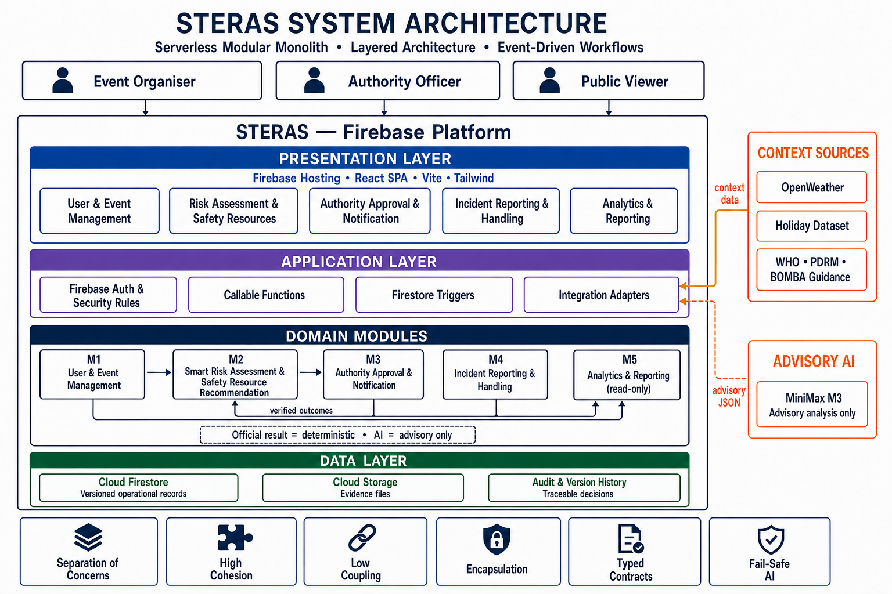
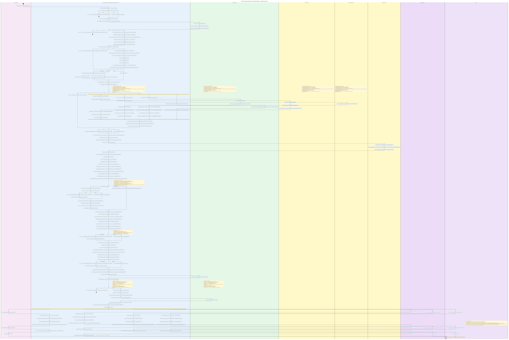
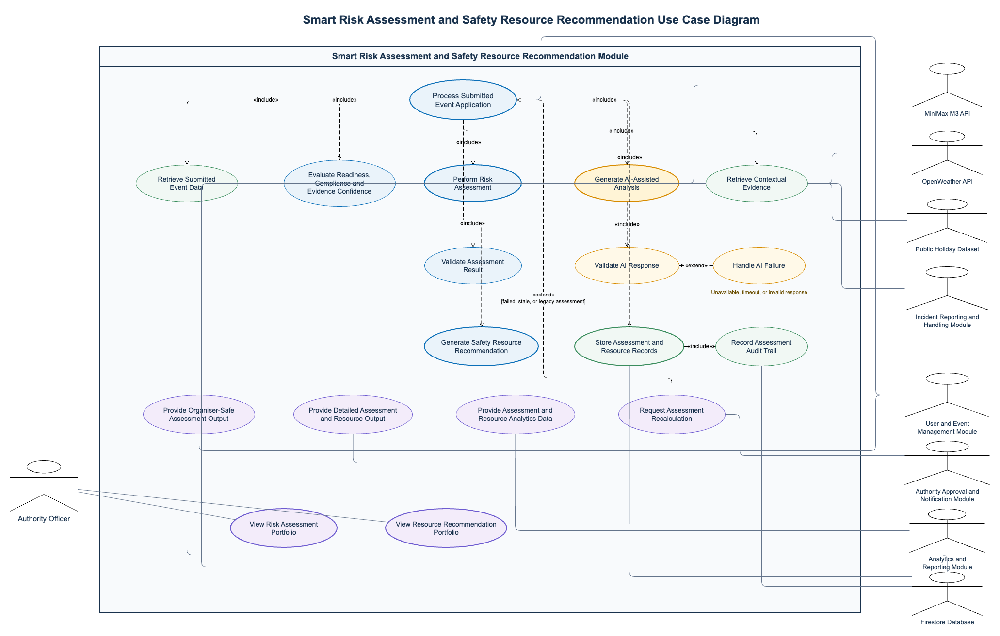

# STERAS Architecture

## Smart Risk Assessment Activity Diagrams

The detailed activity diagram is one continuous workflow rather than separate
UC-labelled sections. Basic Flow actions are shown as activities with their
`[FR-M2-xx]` markers, while Alternative Flow, message, and constraint details
are shown in the exception/notes lane. It includes submitted-data retrieval,
contextual evidence providers, AI response validation and failure handling,
deterministic risk calculation, resource planning, auditable storage, and all
role-specific views. Its editable diagrams.net source is
[`architecture/m2-activity-diagram-detailed.drawio`](architecture/m2-activity-diagram-detailed.drawio).
The Draw.io source is a single-page native redraw of the PDF-matched activity
diagram for import into Lucidchart. Swimlane backgrounds, activity boxes,
labels, decisions, notes, state nodes, and connector segments are individual
editable elements; the file contains no embedded diagram image.

The compact team-style overview remains available in
[`architecture/m2-activity-diagram-team-style.svg`](architecture/m2-activity-diagram-team-style.svg),
with editable sources in
[`architecture/m2-activity-diagram-team-style.puml`](architecture/m2-activity-diagram-team-style.puml)
and
[`architecture/m2-activity-diagram-team-style.drawio`](architecture/m2-activity-diagram-team-style.drawio).

## Smart Risk Assessment and Safety Resource Recommendation Use Case Diagram

The editable diagrams.net source is
[`architecture/smart-risk-assessment-resource-recommendation-use-case.drawio`](architecture/smart-risk-assessment-resource-recommendation-use-case.drawio).
It separates submitted-event retrieval, contextual evidence collection,
readiness checks, risk assessment, assessment-result validation, AI-assisted
analysis, resource recommendation, persistence, audit recording, cross-module
outputs, monitoring, and recalculation paths. It intentionally does not lock a
specific scoring formula or assessment method.

## Architecture Model

STERAS is a **serverless modular monolith** with a **layered structure** and a
hybrid **request-response plus event-driven workflow**.

- **Serverless:** Firebase Hosting, Authentication, Cloud Functions, Firestore,
  and Cloud Storage provide the managed runtime.
- **Modular monolith:** M1-M5 have cohesive responsibilities and typed
  contracts, but the frontend and Functions are still deployed as two shared
  application units rather than independently operated microservices.
- **Layered:** Presentation, application/orchestration, domain logic, and data
  responsibilities are separated.
- **Event-driven:** Firestore document changes trigger assessment and
  recomputation workflows. Callable Functions handle explicit user commands.
- **C4-inspired view:** The diagram combines a C4 Container View with the most
  important domain components so that both technology and module ownership are
  visible.

## Layer Responsibilities

| Layer | Responsibility |
|---|---|
| Presentation | React routes and role-specific views for organisers, authorities, and the public |
| Application | Authentication, access control, callable commands, Firestore triggers, orchestration, and integration adapters |
| Domain | M1 event lifecycle, M2 validated category assessment and deterministic calculation/resource rules, M3 human decisions, M4 incident workflow, and read-only M5 aggregation |
| Data | Firestore records, Storage evidence, assessment versions, decisions, and audit history |

External services are isolated behind adapters. OpenWeather, the holiday
dataset, and standards guidance provide contextual evidence. MiniMax M3
proposes structured hazard categories, likelihood, severity, explanations, and
contextual suggestions. M2 validates that output against its schema, available
evidence, scoring rubric, and hard rules before calculating a reproducible risk
result. An authority officer confirms that result or records a justified
override before it becomes the official assessment.

## Applied Design Principles

| Principle | STERAS application |
|---|---|
| Separation of concerns | UI, orchestration, domain rules, integrations, persistence, and human decisions have different owners |
| Decomposition and modularity | M1-M5 decompose the product by business capability and page ownership |
| High cohesion | Risk scoring and resource logic stay inside M2; authority decisions stay inside M3 |
| Low coupling | Modules exchange versioned shared types and persisted contracts instead of importing each other's page logic |
| Encapsulation | Secrets and protected state transitions remain in Cloud Functions; Security Rules protect client access |
| Interface/implementation separation | Callable APIs, shared TypeScript contracts, and adapter boundaries hide implementation details |
| Fail-safe design | AI timeout or invalid output leads to an explicit retry or manual-assessment path; the system does not fabricate a score |
| Sufficiency and auditability | Context snapshots, schema versions, rationales, decisions, and audit records make results reviewable |

## Important Runtime Constraints

- Firestore events may be delivered more than once and ordering is not
  guaranteed; triggers must therefore be idempotent.
- Firebase Admin SDK operations in Cloud Functions are trusted server
  operations and are not protected by client Security Rules, so Functions must
  validate authorisation and business invariants.
- M5 reads operational records for reporting but must not become a source of
  business decisions.
- M4 incidents affect only a future assessment or an explicit versioned
  recomputation; they never silently rewrite a stored assessment.

## References

- [STERAS PRD](../STERAS_PRD.md)
- [C4 Container Diagram](https://c4model.com/diagrams/container)
- [ISO/IEC 25010:2023 Product Quality Model](https://www.iso.org/standard/78176.html)
- [Cloud Functions for Firebase](https://firebase.google.com/docs/functions)
- [Cloud Firestore Triggers](https://firebase.google.com/docs/functions/firestore-events)
- [Firebase Security Rules](https://firebase.google.com/docs/rules)
- [Firebase Local Emulator Suite](https://firebase.google.com/docs/emulator-suite)
