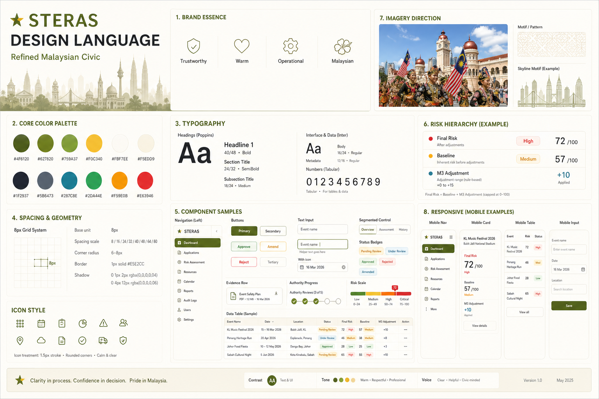

# STERAS Design Language



The image above is a foundational mood reference. This document and the live shared components are the normative source when they differ from the board.

## 1. Direction

STERAS uses a **refined Malaysian civic** design language: warm, trustworthy, locally grounded, and efficient for repeated authority work. It follows the visual character of `design-sample.png` without reproducing its outdated AI model.

The interface should feel like one coherent operational system, not a collection of decorative dashboard cards. Safety-critical information is calm and prominent; tourism character appears through color, imagery, and restrained Malaysian motifs.

Authority workspaces use the **Civic Observatory** expression of this language: warm paper-like surfaces, deep olive operational bands, fine woven linework, and data-driven radar or route motifs. Public and authentication pages may be more photographic, but they must retain the same type, color, spacing, and component contracts.

## 2. Core Principles

1. **Final risk first.** Show the authoritative final score before its baseline and bounded M3 adjustment.
2. **Evidence over decoration.** Provenance, files, versions, and agency decisions are easier to find than visual effects.
3. **Warm but operational.** Cream surfaces and gold accents add civic warmth while dense workflows remain crisp.
4. **Semantic color has meaning.** Red, amber, and green communicate risk or status, never decoration alone.
5. **One system across roles.** Organizer, authority, analytics, and public views share tokens and typography while adapting density.
6. **Reuse before invention.** Shared risk, status, button, and motion patterns are extended through supported variants rather than recreated per page.

## 3. Color System

| Token | Hex | Use |
|---|---|---|
| `brand-700` | `#4F6120` | Active navigation, strong headings |
| `brand-600` | `#627820` | Primary actions, links, focus |
| `brand-500` | `#759A37` | Charts and secondary accents |
| `brand-accent` | `#83C732` | Small approval highlights only |
| `gold-300` | `#F0C340` | Pending, tourism accents, selected details |
| `gold-600` | `#A17932` | Gold text on light backgrounds |
| `cream-50` | `#FBF7EE` | App background |
| `cream-100` | `#F5EDD9` | Secondary bands and hover states |
| `ink-800` | `#1F2937` | Primary text |
| `ink-500` | `#5B6473` | Secondary text |
| `info` | `#287C8E` | Source and evidence information |
| `status-approved` | `#2DA44E` | Approved workflow state |
| `status-review` | `#F59E0B` | Under review and amendments |
| `status-rejected` | `#E63946` | Rejected state and destructive action |

Use warm white as the dominant surface. Olive and gold provide identity; semantic colors must remain sparse. Do not create full-page gradients or monochrome olive screens.

Risk has three color roles so contrast remains intentional across contexts:

| Role | Low | Medium | High | Use |
|---|---|---|---|---|
| Fill | `risk-low` | `risk-medium` | `risk-high` | Charts, maps, and data marks |
| Surface text | `risk-low-text` | `risk-medium-text` | `risk-high-text` | RiskMeter on cream or white |
| Inverse text | `risk-low-inverse` | `risk-medium-inverse` | `risk-high-inverse` | RiskMeter on deep olive |

Risk and workflow status remain separate semantic namespaces even when two tokens share a hex value. Do not use a status token for a risk visualization or vice versa.

## 4. Typography

- **Display and headings:** Plus Jakarta Sans, 500-800 weight.
- **UI and data:** Source Sans 3, 400-700 weight.
- **Page title:** 24-30px desktop, 22-26px mobile.
- **Section title:** 15-18px.
- **Body:** 14px, 1.5 line height.
- **Metadata:** 12px, never below 11px.
- **Numeric emphasis:** tabular figures where supported.

Use sentence case and default letter spacing for normal UI. Large display headings may use `-0.02em` to `-0.04em`; compact uppercase system labels such as RiskMeter may use approximately `0.055em`. Reserve large type for page identity and authoritative risk values.

## 5. Layout and Spacing

Use an 8px spacing system: `4, 8, 12, 16, 24, 32, 40`. Desktop authority screens use a 232-256px sidebar and a fluid workspace. Review pages may use a `minmax(0, 1fr) 320px` main/decision split.

- Page maximum width: 1440px where content benefits from constraint.
- Standard card radius: 6-10px; avoid pill-shaped containers.
- Signature hero and mobile navigation surfaces may use 12-14px when their role is visually distinct.
- Card padding: 16px compact, 24px standard.
- Section gap: 20-24px.
- Borders: 1px warm gray; shadows remain subtle.
- Tables and queues should be dense, aligned, and scannable.

Do not nest cards. Use full-width bands, dividers, or internal grids inside one framed tool.

## 6. Component Language

### Navigation

Use line icons with concise labels. Active items use an olive fill or left indicator. Show only implemented destinations. Mobile authority navigation is a stable four-item bottom bar.

### Buttons

- Primary: olive background, white text.
- Secondary: white background, warm-gray border.
- Approve: semantic green.
- Reject: red, used only at the decision point.
- Amendment: outlined amber or gold.
- Minimum touch target: 44px.

### Cards and Panels

Cards frame individual tools such as an assessment, evidence list, or decision panel. Headers use a divider and compact title. Avoid excessive KPI-card grids and decorative hover movement.

### Status and Risk

Workflow status and assessed risk are related but not interchangeable:

- `StatusBadge` is the canonical workflow-state component for Pending, Under Review, Approved, Amendment Requested, Rejected, Withdrawn, and Draft.
- `RiskMeter` is the canonical assessed-risk component everywhere. Low activates one ascending tick, Medium two, and High three; inactive ticks stay visible so the scale remains legible.
- Every RiskMeter includes visible `Low Risk`, `Medium Risk`, or `High Risk` text. Never rely on color or tick count alone.
- Use `size="compact"` in dense tables and hero lockups. Use the default size on review and detail screens.
- Use the default `tone="surface"` on light surfaces and `tone="inverse"` on deep olive surfaces.
- Keep the numeric score adjacent to the meter. Do not place it inside the component or replace it with a generic filled badge.

```tsx
<RiskMeter level={assessment.finalRiskLevel} size="compact" />
<RiskMeter level={assessment.finalRiskLevel} size="compact" tone="inverse" />
```

### Forms

Labels stay above fields. Required state, help, and errors are explicit. Inputs use white surfaces, warm-gray borders, and an olive focus ring. Long forms are divided by meaningful fieldsets, not nested cards.

## 7. Risk Presentation Contract

Always present risk in this order:

1. **Final risk score and RiskMeter level** as the dominant result.
2. **Deterministic baseline** with rule version and source timestamps.
3. **M3 bounded adjustment** shown as `+0` to `+15`, with status and concise evidence-based reasoning.
4. **Five deterministic sub-scores:** weather, crowd, venue, history, holiday.
5. **Recommended resources** and authority validation state.

Never show a separate AI score, AI-versus-rule disagreement, robot icon, or agreement percentage. MiniMax refines the baseline; it does not compete with it.

## 8. Imagery and Malaysian Identity

Use bright, inspectable images of real Malaysian tourism events, venues, and public spaces. Prefer daylight, visible participants, authentic cultural detail, and clear context. Avoid dark atmospheric stock imagery.

Malaysian identity should come from warm tropical light, olive/gold color, local event content, and restrained skyline or woven-pattern motifs. Woven, radar, and route motifs must reinforce live coverage or portfolio structure instead of becoming wallpaper. Do not use flag graphics, landmark collages, or official agency crests as decoration.

## 9. Charts and Data

Charts use flat fills, direct labels, and the core palette. Limit each chart to the colors needed for its meaning. Provide text summaries and accessible legends. Analytics must never expose organizer PII.

## 10. Motion System

Motion supports hierarchy and system feedback. Use shared motion tokens rather than inventing page-specific timings:

| Token | Duration | Use |
|---|---:|---|
| `--motion-duration-feedback` | `120ms` | Press, hover, and immediate acknowledgement |
| `--motion-duration-state` | `220ms` | Selection, disclosure, and small state changes |
| `--motion-duration-panel` | `420ms` | Panel, row, and chart entrances |
| `--motion-duration-entrance` | `560ms` | One orchestrated page or hero entrance |

Use the shared quart, quint, and expo ease-out curves. Prefer opacity and transform for animated movement. A page may have one coordinated entrance sequence; looping motion is reserved for genuinely live state or loading feedback. Always provide a reduced-motion path that removes non-essential animation and leaves content visible.

## 11. Responsive and Accessibility

- Design and verify at 390px, tablet, and desktop.
- Preserve final risk, status, evidence, and decision actions on mobile.
- In event rows and hero lockups, keep the full event name and stack the risk meter and score below it when horizontal space is limited.
- Stack complex review columns; do not shrink desktop grids until text becomes unreadable.
- Keep mobile authority navigation above the safe area and retain at least 44px touch targets.
- Meet WCAG AA contrast where practical.
- Use visible `:focus-visible` states and logical keyboard order.
- Support text wrapping and long authority/event names without overlap.
- Respect reduced-motion preferences; motion is optional and functional.

## 12. Do and Avoid

**Do:** use calm hierarchy, warm whitespace, compact tables, clear provenance, restrained Malaysian motifs, familiar icons, and consistent tokens.

**Avoid:** generic SaaS gradients, glassmorphism, giant marketing headings, dark navy dashboards, decorative blobs, oversized rounding, nested cards, fake controls, monochrome olive pages, and outdated AI comparison concepts.

## 13. Implementation Source

Use `frontend/tailwind.config.js` as the color and type token source and `frontend/src/index.css` for shared component and motion primitives. `frontend/src/components/ui/RiskMeter.tsx` owns risk-level presentation; `frontend/src/components/ui/StatusBadge.tsx` owns workflow-state presentation. New screens must consume these sources instead of introducing one-off risk colors, badge variants, or animation timings.
