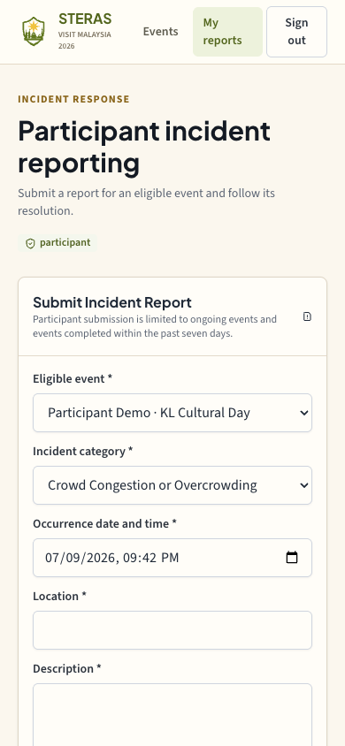

# Participant incident workflow and demo data

## Implemented behavior

- Only a signed-in participant (`public` role) can submit an incident report.
- Organizers can review and act on reports for their own events.
- Authority officers can review and investigate reports assigned to their exact account and authority type.
- Admin retains authority-directory administration without incident review access.
- The participant event selector contains only approved events that have started and are ongoing or ended within the past seven days. The backend repeats the same validation during submission.
- The participant form uses the ten requested incident categories with user-facing labels.

## Managed demonstration dataset

Dataset ID: `steras-presentation-portfolio-2026-09-v1`.

The managed dataset contains 17 events and 17 incidents. Five approved events are scheduled relative to the seed execution time so the incident form always has usable records:

1. Two ongoing events, started two and five hours before seeding.
2. Three recently completed events, started one, four and seven days before seeding.

The five participant scenarios contain two incidents each and cover every requested category. All records carry `synthetic: true` or the dataset ownership marker. Re-applying replaces only records owned by this dataset; it refuses to delete a colliding record without the matching marker.

| Module | Seeded data |
|---|---|
| M1 | Event applications, versions, application evidence, venue and organizer details |
| M2 | Context snapshots, category assessments, authority score reviews and resource recommendations |
| M3 | Initial review, authority assignments and decisions, event controls, Stage 1 documents and Stage 2 evidence |
| M4 | Participant reports, ten categories, severities, workflow states, evidence and append-only history |
| M5 | A sufficiently varied portfolio for status, risk, resources and incident analytics |

## Commands

Preview without writes:

```bash
npm --workspace functions run seed:presentation-portfolio -- --dry-run --project linkos-496505
```

Apply the managed dataset:

```bash
npm --workspace functions run seed:presentation-portfolio -- --apply --project linkos-496505 --confirm linkos-496505
```

Verify schema, artifacts, count, reportable window and category coverage:

```bash
npm --workspace functions run seed:presentation-portfolio -- --verify --project linkos-496505
```

## Acceptance evidence

Focused tests cover participant-only submission, organizer/authority action ownership, future/old event rejection, exact category labels, admin separation, and authenticated participant navigation. Production browser verification confirmed that only eligible events are listed and that the authority page does not show the submission form. A real participant submission should use clearly synthetic text and should be removed or retained as labeled demo evidence according to the presentation plan.

## Production result

- Released from commit `c4878a0`; the participant demo binding is in `e5848c8`, and the final authenticated public-header correction is in `9f11770`.
- Hosting and `submitIncident`, `listIncidents`, and `getIncidentEvidenceDownloadUrl` were deployed to `linkos-496505`.
- Dataset apply and verify passed: 17 events, 17 incidents, five prepared reportable events, and all ten categories.
- The live participant selector displayed six eligible events: the five prepared records plus one independently existing eligible event. This is expected because the selector includes every eligible approved event, rather than only the managed dataset.
- The live participant account displayed 17 owned synthetic incident records, all ten labels, and an automatically suggested valid occurrence time. The 390-pixel viewport had a 390-pixel document width.
- The live authority workspace displayed the review explanation and zero submission headings/buttons.
- The dedicated account is `participant.showcase@steras.test`. Its password is stored only in the local restricted file `output/ui-feedback/participant-demo-credentials.txt` and is not committed.


